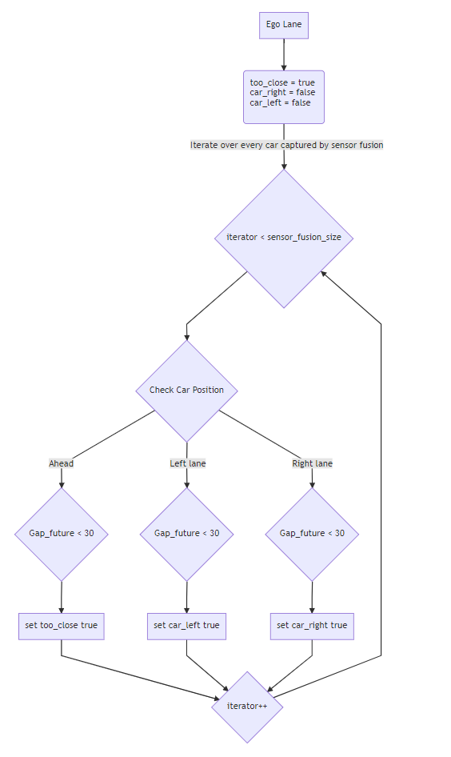
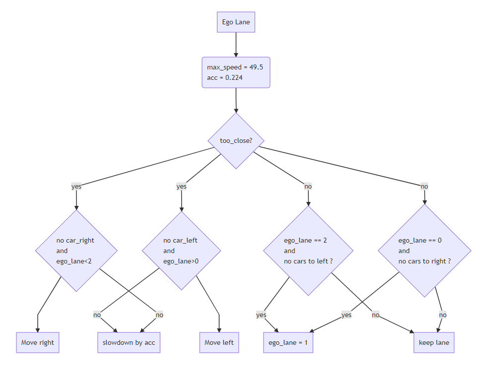

# Project: Build a Path Planner that drives safely on a 3-lane Highway
[](http://www.udacity.com/drive)


## Overview
In this project, the goal is to safely navigate around a virtual highway with other traffic that is driving +-10 MPH of the 50 MPH speed limit. Your car on road is referred to as **ego** car.

---
### The Project
Path-planning solution aims to meet the following requirements:
* The ego car should try to go as close as possible to the 50 MPH speed limit, which means passing slower traffic when possible, note that other cars will try to change lanes too.
* The ego car should avoid hitting other cars at all cost as well as driving inside of the marked road lanes at all times, unless going from one lane to another.
* The ego car should be able to make one complete loop around the 6946m highway. Since the car is trying to go 50 MPH, it should take a little over 5 minutes to complete 1 loop.
* The ego car should not experience total acceleration over 10 m/s^2 and jerk that is greater than 10 m/s^3.

---
### Input Dataset
Udacity provided the car's localization and sensor fusion data, there is also a sparse map list of waypoints around the highway.

#### The map of the highway is in data/highway_map.txt
Each waypoint in the list contains  [x,y,s,dx,dy] values. x and y are the waypoint's map coordinate position, the s value is the distance along the road to get to that waypoint in meters, the dx and dy values define the unit normal vector pointing outward of the highway loop.

The highway's waypoints loop around so the Frenet s value, distance along the road, goes from 0 to 6945.554.

Here is the data provided from the Simulator to the C++ Program

#### Main car's localization Data (No Noise)

["x"] The car's x position in map coordinates

["y"] The car's y position in map coordinates

["s"] The car's s position in frenet coordinates

["d"] The car's d position in frenet coordinates

["yaw"] The car's yaw angle in the map

["speed"] The car's speed in MPH

#### Previous path data given to the Planner

//Note: Return the previous list but with processed points removed, can be a nice tool to show how far along
the path has processed since last time.

["previous_path_x"] The previous list of x points previously given to the simulator

["previous_path_y"] The previous list of y points previously given to the simulator

#### Previous path's end s and d values

["end_path_s"] The previous list's last point's frenet s value

["end_path_d"] The previous list's last point's frenet d value

#### Sensor Fusion Data, a list of all other car's attributes on the same side of the road. (No Noise)

["sensor_fusion"] A 2d vector of cars and then that car's [car's unique ID, car's x position in map coordinates, car's y position in map coordinates, car's x velocity in m/s, car's y velocity in m/s, car's s position in frenet coordinates, car's d position in frenet coordinates.

---
### Project Solution

Ptah planning is implemented by taking a simpler approach of three major steps as detailed below.

#### 1 Prediction of other vehicle behaviour from Sensor Fusion Data

Prediction of the behaviour of every other car detected by the sensors is taken
according to the flowchart presented in Figure 1. Note that we only predict the
behaviour of one object at a time. Cars around are classified into three main categories.
If the car ahead is too close, or within the gap distance of 30 m from both behind and front if they are in the neighbouring lanes. For this, at first the lane of the car is
derived from their respective d and s values and their closeness is determined
based on checking their gap considering their projected future position values.

<p align="center">

</p>
<p align="center">
<em>Figure 1: Sensor Fusion based Prediction Flow chart</em>
</p>

End of this phase would have predicted if there is any car in the close proximity of the
ego car either ahead, or right or left.

#### 2. Behaviour Planning for deciding the trajectory of the ego-vehicle.

From the prediction step, cars in the proximity of the ego vehicle are noted.
A finite machine is implemented as shown in Figure 2 for deciding the speed of the car and lane movements. If there is a car ahead in the proximity, ego car has to slow down or change the lanes if the lane is clear and safe. If there is no collision issue, then the car tries to either keep in the lane trying to keep maximum speed limit, trying to accelerate smoothly to avoid jerks, if needed. Also, car tries to move to the centre lane if it is safe to do so, when it is in either of the side lanes to not be stuck in fast or slow lane.  

<p align="center">

</p>
<p align="center">
<em>Figure 2: Finite State Machine for Behaviour Planning</em>
</p>

#### 3. Trajectory Generation
After the high level trajectory is planned for the ego vehicle about the speed and lane movement, trajectory for the planned path is generated in this step.

For trajectory generation, two points from previous waypoints are taken and three more are created to it in 30 m space. If previous points are less than 2, then the points are generated based on the current ego car position and angle. The way points are converted to car coordinates  to make computation easier.

Smooth trajectory for the ego vehicle is generated using the http://kluge.in-chemnitz.de/opensource/spline/ function. Spline points are created upon considering that we need to move ahead by 30 m in this interval. The points are generated to make sure that there are always 50 points to move ahead. It really depends on the simulator speed, that how many points are covered in one cycle.

---
### Project Details provided by Udacity

1. The car uses a perfect controller and will visit every (x,y) point it receives in the list every .02 seconds. The units for the (x,y) points are in meters and the spacing of the points determines the speed of the car. The vector going from a point to the next point in the list dictates the angle of the car. Acceleration both in the tangential and normal directions is measured along with the jerk, the rate of change of total Acceleration. The (x,y) point paths that the planner receives should not have a total acceleration that goes over 10 m/s^2, also the jerk should not go over 50 m/s^3. (NOTE: As this is BETA, these requirements might change. Also currently jerk is over a .02 second interval, it would probably be better to average total acceleration over 1 second and measure jerk from that.

2. There will be some latency between the simulator running and the path planner returning a path, with optimized code usually its not very long maybe just 1-3 time steps. During this delay the simulator will continue using points that it was last given, because of this its a good idea to store the last points you have used so you can have a smooth transition. previous_path_x, and previous_path_y can be helpful for this transition since they show the last points given to the simulator controller with the processed points already removed. You would either return a path that extends this previous path or make sure to create a new path that has a smooth transition with this last path.

---

### Run instructions

#### Simulator.
You can download the Term3 Simulator which contains the Path Planning Project from the [releases tab (https://github.com/udacity/self-driving-car-sim/releases/tag/T3_v1.2).

#### Basic Build Instructions

1. Clone this repo.
2. Make a build directory: `mkdir build && cd build`
3. Compile: `cmake .. && make`
4. Run it: `./path_planning`.


#### Dependencies

* cmake >= 3.5
  * All OSes: [click here for installation instructions](https://cmake.org/install/)
* make >= 4.1
  * Linux: make is installed by default on most Linux distros
  * Mac: [install Xcode command line tools to get make](https://developer.apple.com/xcode/features/)
  * Windows: [Click here for installation instructions](http://gnuwin32.sourceforge.net/packages/make.htm)
* gcc/g++ >= 5.4
  * Linux: gcc / g++ is installed by default on most Linux distros
  * Mac: same deal as make - [install Xcode command line tools]((https://developer.apple.com/xcode/features/)
  * Windows: recommend using [MinGW](http://www.mingw.org/)
* [uWebSockets](https://github.com/uWebSockets/uWebSockets)
  * Run either `install-mac.sh` or `install-ubuntu.sh`.
  * If you install from source, checkout to commit `e94b6e1`, i.e.
    ```
    git clone https://github.com/uWebSockets/uWebSockets
    cd uWebSockets
    git checkout e94b6e1
    ```
